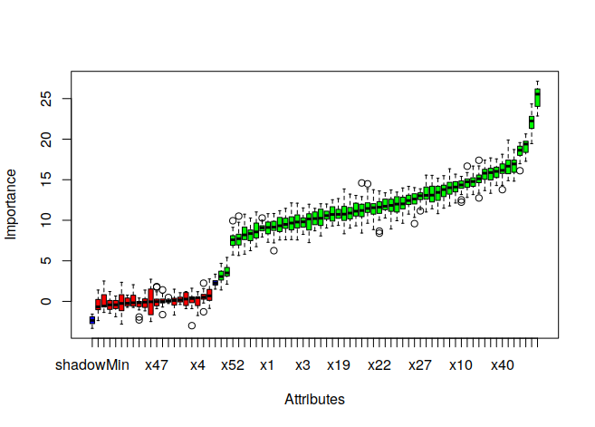

# Ripper

## Análisis exploratorio de los datos
### Tipo de los datos y valores perdidos
#### análisis de variables tipo factor
Se comenzó haciendo un análisis de la base de datos sobre la que aplicar el algoritmo RIPPER. Para ello, se buscaron cuáles y cuantas eran las variables tipo factor y tipo numérico, cuantas variables perdidas había en el dataset de cada tipo. 
las conclusioniones obtenidas de esta fase, fueron:

- que el dataset contiene 5 variables tipo factor: X0, X14, X17, X51 y X63 
- hay [2-5] valores perdidos por variable tipo factor y todas las variables presentan valores perdidos
- X0 , X14 y X63 tienen 5 valores perdidos cada una
- X17 tiene 4 valores perdidos
- X61 tiene 3 valores perdidos 
- X51 tiene 2 valores perdidos

Por lo que inicialmente se tomó el enfoque de eliminar todos los valores perdidos de tipo factor, dado que suman menos de 25 entre un dataset de 2728 instancias.

#### análisis de variables numéricas
Se hizo un análisis que respondiera a las preguntas: cuantos valores "NA" y "NAN" hay entre los las columnas tipo numérico, cuales son las columnas con "NA", cuantos valores perdidos hay en cada una de las columnas numéricas, que columnas tienen más NAs y cuantas columnas hay con NAs.
Las conclusiones obtenidas de esta fase, fueron:
## Conclusiones 
- x[1, 2, 3, 4, 5, 6, 8, 9, 10, 11, 12, 13, 15, 16],  x[18, 19, 20, 21, 22, 23, 24, 25, 26, 27, 28, 29, 30, 31, 32, 33, 34, 35, 36, 37, 38, 39, 40, 41, 42, 43, 44, 45, 46, 47, 48, 49, 50], x[52, 53, 54, 55, 56, 57, 58, 59, 60] x62 x[64, 65, 66, 67, 68, 69, 70] y  x[72, 73, 74] son variables numéricas y hay 69 variables que tienen valores perdidos
- x74, x73, x72, x70 y x69 son las que más NAS tienen con 75,74,73,71 y 70 respectivamente
- el número de NAs es el índice de la variable +1

Como la cantidad de valores numéricos perdidos sí es significativa, se toma como primer enfoque imputar los valores numéricos perdidos mediante KNN.

### Análisis de relaciones entre variables
Para estudiar la relación entre variables, se emplea la **matriz de correlación** usando la función **cor** y filtrando por las variables con una correlación del 80% o más. Encontramos que las variables X41 y X48 están correladas con valor superior a 0.8. De hecho, se plantea una ecuación básica para calcular el escalar por multiplicación del cual se obtiene una columna a partir de la otra. Se comprueba cual de las dos columnas dependientes es la que más valores perdidos tiene (x41), y se toma la decisión de eliminarla, conservando x48 en el conjunto de datos. Se obtienen los valores perdidos de la variable x48 a partir de los valores de x41 y el escalar calculado (43.38980659714715).

```
# calculamos los valores de x48 que faltan a partir de x41
escalar<-43.38980659714715
data$x48[703]<-data$x41[703]/escalar
data$x48[995]<-data$x41[995]/escalar
data$x48[1928]<-data$x41[1928]/escalar
data$x48[2535]<-data$x41[2535]/escalar
```

## Preprocesamiento y enfoques del problema
En esta práctica se aplican varios métodos de preprocesamiento, dependiendo del enfoque considerado. En general, el preprocesamiento aplicado se resume en:
- 1) Imputar los valores perdidos de una columna (x48) a partir de otra dependiente (x41)
- 2) Imputar valores perdidos numéricos por columna con KNN usando la distancia euclídea como métrica
- 3) Imputar valores perdidos factores por columna considerando la moda de esa variable
- 4) Imputar valores perdidos factores por columna considerando la moda de esa variable por clase 
- 5) Downsampling para atajar el desbalanceo
- 6) Upsampling para atajar el desbalanceo
- 7) Selección de características relevantes


### Imputar los valores perdidos de variables numéricas
En el enfoque inicial se tomó la decición de eliminar las variables tipo factor, dado que eran pocas y contenían valores perdidos. Se calcularon los valores perdidos de la variable x48 a partir de x41 y se imputaron el resto de valores perdidos en variables numéricas separadamente para los datos de Train y Test, usando una imputación con KNN usando como métrica la distancia euclídea, a través del paquete `robCompositions` y su función `impKNNa`. 


Como se puede ver en la imágen, con el uso de `impKNNA` los valores imputados (rojo) toman valores dentro del rango de su respectiva variable (azul).

### Imputar valores perdidos factores por columna considerando la moda de esa variable
Como segundo enfoque, se tomó la decisión se atajar el problema de los valores perdidos en factores, en lugar de simplemente eliminarlos. Para ello se probaron dos metodologías distintas:
- imputación de los factores por moda: para lo que simplemente se calcula el valor de la moda de una columna y se asigna ese valor a los valores perdidos. Se implementó la siguiente función que calcula la moda de una columna:

```
Mode <- function(c) {
  mode<-levels(c)[which.max(table(c))]
  mode
}

imputeByMode<-function(c){
  missing<-which(c=="")
  mod<-Mode(c)
  for(i in missing){
    c[i]<-mod
  }
c 
}
```

- imputación de los factores por moda por clase: para lo que se calcula el valor de la moda de una columna según la clase a la que pertenezca la instancia con valores perdidos. Para ello se implementó la siguiente función que calcula la moda por clase:

```
imputefactors<-function(col){
  missing<-which(col=="")
  for(i in missing){
    col[i]<-colnames(table(data$y,col))[which.max(table(data$y,col)[TrainClasses[i]+1,])]
  }
  col
}
```

Los experimentos demostraron que la imputación de variables factores por moda por clase repercutía en un mayor porcentaje de acierto del modelo.

### Desbalanceo
Los datos de entrenamiento presentan la siguiente distribución por clase:

```
  0   1   2   3 
 249 620 920 939 
```
Por lo que el problema tiene dos clases minoritarias, especialmente la clase 0, por tener un número de muestras muy distinto a las demás. Para atajar este problema, se prueba a replicar las clases minoritarias (Upsampling) y eliminar muestras de las clases minoritarias (Downsampling) para balancear el dataset. Para ello se usan las funciones `downSample` y `upSample` del paquete `caret`. También se probó a usar SMOTE pero se conseguían peores resultados que con las funciones ya mencionadas.

En todos los experimentos el upsampling demostró mejores resultados en acierto de clasificación que el downsampling, por lo que finalmente se optó por hacer upsampling.

### Selección de características relevantes
Para realizar la selección de características se empleó la técnica de eliminación recursiva de características, disponible en `caret` a través del método `rfe()`. Sin embargo, su ejecución tardó más de un día, y al comentar el problema, el compañero Gabriel propuso usar Boruta en lugar de RFE, por lo que finalmente se usó el método `Boruta` del paquete `Boruta` para seleccionar las características más relevantes, obteniendo que:
- había 55 atributos importantes entre los que se encontaban x1, x10, x11, x12, x13.
- había 19 atributos no relevantes, como x0, x16, x24, x29 o x30.



Por lo que se eliminaron las variables no relevantes para entrenar el modelo, entre las que se encontraban los factores X0 y X14.


## Resultados

En esta sección se muestra una tabla de los distintos experimentos realizados para el algoritmo RIPPER con este dataset y los resultados de clasificación de test públicos y privados obtenidos en Kaggle.

|        Experimento          | Clasif. Test Privada  | Clasif. Test Pública |
|-----------------------------|:---------------------:|---------------------:|
| UPSAMPLE+KNNA               |       0.53308         |       0.57177        |
| UPSAMPLE+KNNA+FImpByClass   |       0.52573         |       0.58880        |
| UPSAMPLE+KNNA+FImp+FS       |       0.56617         |       0.53284        |
| UPSAMPLE+KNNA+FImpByClass+FS|       0.59926         |       0.58394        |
| DOWNSAMPLE+KNNA+FImpByClass |       0.45588         |       0.49148        |

Donde KNNA es el método empleado para la imputación de valores perdidos numéricos, FImpByClass es imputación de valores perdidos en factores por moda por clase y FImp es la imputación de valores perdidos por la moda de la variable, sin tener en cuenta la clase.
Los resultados muestran que la mayor tasa de clasificación se observa para el upsample con imputación por KNN de números, imputación por moda por clase de factores perdidos con selección de características, obteniendo de media de ambas clasificaciones un 0.5916 con RIPPER. A pesar de que la mejor clasificación en Test pública es de 0.58880 con el segundo experimento, su clasificación test privada es 0.52, es decir, que los resultados del experimento (2) varían más dependiendo del subconjunto de datos que tome Kaggle para evaluar, mientras que los del experimento (4) parecen más robustos ya que no varían tanto entre clasificación privada y pública.


